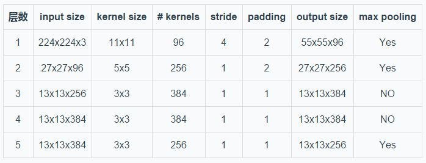

### 1. 是什么

一般意义下的神经网络是指全连接网络，就是说相邻两层神经元之间，两两互相连接，形成稠密的网络，例如，我们之前介绍的手写字识别的全连接网络。

我们把28*28的图的每一个像素展开，形成了一个784维的输入向量，然后通过两层网络的映射，得到最终的10种分类的结果。

直观上说，这种网络的结构，对于784个输入像素没有做任何区分，全部一视同仁的丢给隐藏层去发现他们之间的关联，进而收集到种种特征用以佐证当前图片是哪一个数字。

首先介绍卷积神经网络最重要的两个操作：卷积和池化。

#### 卷积

我们保留图片原有的形状，即二维的矩阵。同时，我们定义一个N*N(例如3\*3)的小矩阵，该矩阵称为卷积核。

接下来，在图像的二维矩阵上按照特定的步长，将卷积核按照先横向再纵向的顺序扫过整个图像，并进行卷积，卷积的意思就是，把卷积核和它当前对应的图像矩阵的值进行相乘并加和，最终得到一个卷积后的矩阵，过程如下图所示：

!

很显然，卷积后得到的输出仍然是矩阵，可以继续在其上执行卷积操作。

当然，我们需要注意的是，图像一般有多通道，例如RGB。如果我们把三个通道的矩阵叠到一起，就变成了一个三维的张量, 例如图中左侧32\*32\*3的红色张量。而卷积核同样也要跟着变成一个N\*N\*3的张量，在图像的二维平面上滑动着做卷积操作。

上图就是5个N\*N\*3的卷积核在依次经过卷积操作后，将原始图像卷成了Width\*Width\*5的张量。所以，下一次卷积核的尺寸应当为N2\*N2\* 5。也就是说，虽说卷积核是三维的，卷积操作也是三维的，但是我们限制了“通道”维度的自由，使得卷积核只在长和宽上移动（当然，这只是典型的卷积网络的做法）。

#### 池化

池化（也叫汇合）操作比较简单，一般有均值池化、最大值池化等，例如，2*2大小，步长1的最大值池化操作示例如下：

#### 全连接层

经过多层的卷积、池化操作后，将最后一层池化层的输出展开，变成一个向量，并用全连接层进行分类。

#### 完整网络结构

以经典的AlexNet为例，网络结构如下：

图中Conv是卷积层，FC是全连接层。（池化层没有明确画出来）

每层卷积的输入、输出和参数规模：

### 2. 为什么

2.1 为什么要引入卷积

我们可以清楚地看到，卷积操作是一种作用于图片局部信息的操作，即，每个卷积核只关注一小片区域的信息（例如3\*3，或者5\*5）。每一类卷积核，处理一类通用的特征提取任务。

举个例子，如果一个卷积核的值是:
$$
\begin{bmatrix}
	0 && -4 && 0 \\
	-4 && 16 && -4\\
	0  && -4 && 0
\end{bmatrix}
$$

那么，这个卷积核将很擅长找到边缘像素。因为，如果在大片同样颜色的区域，某一个点周围的值都是相同的，那么它们的值在经过上面的卷积后，将变为0。而，如果在边缘区域，经过上述卷积后，将很大概率不为0。

同样的原因，形如：
$$
\begin{bmatrix}
	1 && -2 && 1 \\
	0 && 0 && 0\\
	1  && 2 && 1
\end{bmatrix}
$$
的卷积核擅长找横向边缘，而形如：
$$
\begin{bmatrix}
	1 && 0 && 1 \\
	-2 && 0 && 2\\
	1  && 0 && 1
\end{bmatrix}
$$
的卷积核擅长找纵向边缘。

上图就是一张图片经过上述三种卷积核处理后得到的图片内容，可以明显看出它们的差异。

在漫长（相对于计算机科学短暂的发展历程而言）的时间里，视觉算法专家们都在尝试手工设计各式各样的滤波器（卷积核）来提取各式各样的特征。而现今的卷积神经网络，更多是利用强大的学习能力自发地找到了能提取各种特征的卷积核，并且体现出了比专家们手工设计的卷积核强大很多的能力。换句话说，海量的数据告诉了CNN网络，应该怎么去合理的设计这些卷积核，才能用它们从低层到高层，从细节到抽象，一步一步的学习出各式各样可以区分世间万物的各式各样的卷积核。

