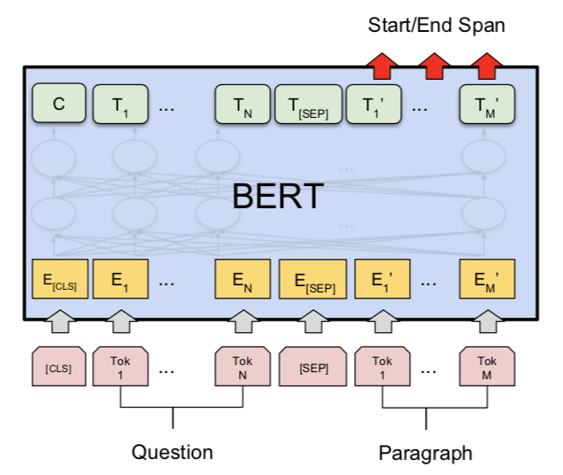

### 背景

机器阅读理解和QA有比较大的关联，需要理解文章，理解问题，进行推理，生成答案等步骤。

可以想象，如果一个机器阅读理解系统能够模仿人类使用搜索引擎的方式：

（1）理解问题，搜索相关文章

（2）理解文章内容，更新对问题的理解

（3）如果需要，根据对问题新的理解再搜索补充文章

（4）循环2、3步骤，直至认为已经通过一系列搜索和阅读推理找到（或归纳）了问题的答案

那么，这个机器可以回答的问题就已经很多了。而不是像现在的大多数系统，只会根据一些关键字进行内容的搜索。

说起来，好像没什么，然而这是目前NLP领域众多学者争相研究的领域，难点重重。

### Squad

那么，先从简单的问题入手吧，例如Squad 1.1这个数据集：

（1）给定一篇文章

（2）问题的答案都可以在给定的文章中以文本片段的形式找到

（3）通常，所需推理的路径都比较短

上面这些条件，极大的限制了问题的难度，当然，也相应的限制了在它之上训练的模型的能力。

下图是当前最先进的深度网络模型可以达到的水平：

看个例子：

**passage**: Super Bowl 50 was an American football game to determine the champion of the National Football League (NFL) for the 2015 season. The American Football Conference (AFC) champion ***Denver Broncos*** defeated the National Football Conference (NFC) champion Carolina Panthers 24–10 to earn their third Super Bowl title. The game was played on February 7, 2016, at Levi’s Stadium in the San Francisco Bay Area at Santa Clara, California. As this was the 50th Super Bowl, the league emphasized the ”golden anniversary” with various gold-themed initiatives, as well as temporarily suspending the tradition of naming each Super Bowl game with Roman numerals (under which the game would have been known as ”Super Bowl L”), so that the logo could prominently feature the Arabic numerals 50. 

**question**: Which NFL team won Super Bowl 50? 

**answer**: Denver Broncos 

当前的深度阅读模型，大多是端到端的，大概是：

文本 -> 词向量 -> 多层上下文/问题编码 -> 全连接层 -> 每个词作为答案开始/结束的概率

例如bert：

拿到每个词作为答案开始和结束的概率之后，即可找出概率最高的开始结束对，它们之间的文本即为答案。

一般，作为一种先验知识（或者可以认为是为了迎合数据集的偏好）和性能上的考虑，开始结束对之间的距离不能超过一个预设的阈值（例如15个单词）。

端到端的深度模型相比传统的基于符号推理的NLP系统有很大的优势，原因之一是符号系统存在着稀疏的问题，例如，

问题：*“How many individual libraries* ***make up*** *the main school library?*” 

文章： “. . . *Harvard Library, which is the world’s largest academic and private library system,* ***comprising*** *79 individual libraries with over 18 million volumes.*” 

我们需要知道make up和comprising表达的是同样的意思，那么，词与词的相似性组合可能就是指数级的，会是一个特别庞大的数字。

而如果了解词向量和contextual word representation，那么知道词与词之间会在语义空间中体现它们间的关联性，因此能够很好的解决稀疏的问题。

也正因此，可以看到，深度网络在Squad上大幅度击败了传统的符号推理系统。